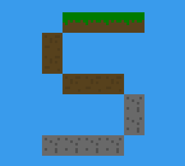
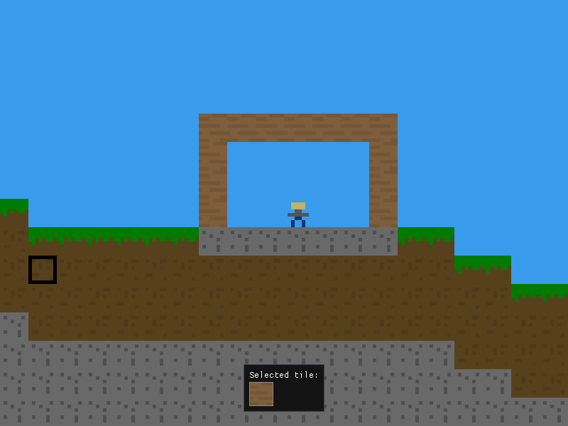

# Sandboxia2D

Sandboxia is a sandbox game written in C++ using OpenGL 3.0. It's designed to be a simple sandbox game that is easy to run on older machines. There aren't any goals in the game. The game is still in development. Sandboxia2D comes with a simple API for mods to add new features to the game. For deeper modding, modify the source code directly. Windows support is still partially experimental.

## Features
- Bugs may be present
- 2D World
- OpenGL 3.0
- VSYNC
- World saving/loading
- Debug mode
- Console
- Support for mods!

# Supported platforms
- Linux: x64, aarch64
- Windows: x64, x86 (experimental)

## How to play

- W, A, S, D to move
- Left mouse button to destroy blocks
- Right mouse button to place blocks
- T to open console

## Pre-requisites
### Linux
- `mesa-common-dev` (for OpenGL)
- `libopenal-dev` (for audio)
- `libsndfile-dev` (for audio)
- `cmake`
- `g++`

You can install these via your package manager.

### Windows
- Visual Studio 2022
- x86-based processor, arm64 isn't officially supported yet.

## Building

### Linux
- Building instructions:
    1. Run `mkdir build`  
    2. Run `cmake -B build` This will generate the Makefile
    3. Run `cmake --build build -j(number of threads)` to build the game.
- Run `./build/Sandboxia` to play the game.
### Windows
Windows support is still experimental. Currently only VS 2022 is supported. To build the game, press the green play button at the top in Visual Studio. You can select between Release and Debug.

## To build a simple mod
This is a simple tutorial on how to build a mod for Sandboxia2D. The `testmod` is included in the `mods` folder. You can use it as a template.
### Linux
    1. Create a `.cpp` file in `mods` folder
    2. Include `mod_api.h` in the mod file
    3. Compile with `g++ -shared -fPIC testmod.cpp -o testmod.so`.

### Windows
    1. Create a `.cpp` file in `mods` folder
    2. Include `mod_api.h` in the mod file
    3. Open Developer Command Prompt(use x64 Native Tools Command Prompt for 64-bit) and cd to the mods folder.
    4. Run `cl /LD testmod.cpp /I"../include" /Fe:testmod.dll` to compile the mod. You can delete other files except the `.dll` file.

Replace `testmod` with your mod name.
If you get errors, make sure you compile to right architecture. And if the game is built with Release, make sure the mod is built with Release too.
Mods will be loaded automatically.

## Launch args

- `-w` to set the width of the window
- `-h` to set the height of the window
- `-v` to set the VSYNC, Default is 1
- `-c` to set the collision, Default is 1
- `-d` to set the debug, Default is 0
- `-noMods` to disable mods
- `-noSounds` to disable sounds

#### Example

`./build/Sandboxia -v 1 -d`

### For debug
There is still legacy renderer included. Use that if you get OpenGL related errors.

Debug keys:

- P to print the player position
- O to print the selector position
- T to print the current tile data at the cursor
- F to print the current FPS

## Screenshots

## TODO
- [ ] Release v1.0.0 version
- [x] Add audio support
- [ ] Add more blocks
- [ ] Make better GUI
- [ ] Add settings menu
- [ ] Better documentation
- [ ] Do optimizations
- [ ] Make Windows fully functional
- [x] Implement modding API
- [x] Replace OpenGL 2.1 with 3.0 core

## Third-party libraries used
- [ImGui](https://github.com/ocornut/imgui)
- [GLFW](https://github.com/glfw/glfw)
- [GLAD](https://github.com/Dav1dde/glad)
- [stb_image](https://github.com/nothings/stb)
- [GLM](https://github.com/g-truc/glm)
- [stb_perlin](https://github.com/nothings/stb)
- [OpenAL Soft](https://github.com/kcat/openal-soft)
- [libsndfile](https://github.com/libsndfile/libsndfile)

## License
Copyright (c) 2024-2025 Benjamin Helle

Sandboxia2D is licensed under the GPL-3.0 license.
