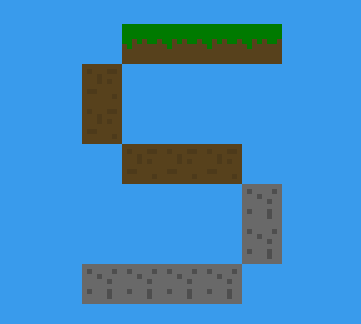
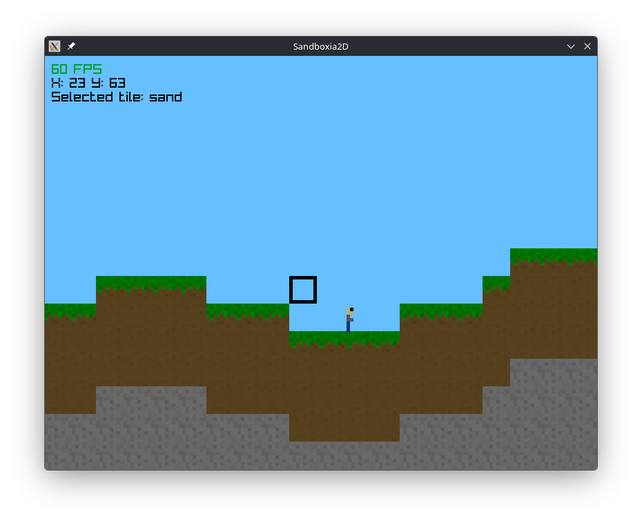

# Sandboxia2D

"Fast, simple and open source sandbox game"

Sandboxia is a sandbox game written in C using Raylib. It was originally written in C++ and used OpenGL based renderer, but it became too messy to maintain.
 It's designed to be a simple sandbox game that is easy to run on older machines. There aren't any goals in the game. The game is still in development. Sandboxia2D comes with a simple Lua API for mods to add new features to the game. For deeper modding, modify the source code directly. Windows support is still partially experimental. 

Currently the game is being rewritten in C, so expect missing features and bugs.

## Features
- Bugs may be present
- 2D World
- World saving/loading
- Debug mode(WIP)
- Console(WIP)
- Support for mods!(Partially implemented)

# Supported platforms
- Linux: x64, x86, aarch64
- Windows: x64, x86 (not tested yet)

## How to play

## Controls
- W, A, S, D to move
- Left mouse button to destroy blocks
- Right mouse button to place blocks
- T to open console(WIP)
- F1 to save current world
- F2 to load world named "world.dat"

## Pre-requisites for Linux
- `cmake`
- `gcc`
- `raylib` (See https://github.com/raysan5/raylib/wiki)
- `lua 5.4` (Other versions may work, but I haven't tested them)

These could be installed using your package manager. If they aren't available, you can build them from source.

### Windows
- Visual Studio 2022
- x86-based processor, arm64 isn't officially supported yet.

## Building

### Linux
Linux is currently the only tested platform.
- Building instructions:
    1. Run `mkdir build`  
    2. Run `cmake -B build` This will generate the Makefile
    3. Run `cmake --build build -j(number of threads)` to build the game.
- Run `./build/Sandboxia` to play the game.

If you get compile errors of stb_perlin, try to comment line `#define STB_PERLIN_IMPLEMENTATION` in `src/game.c`

### Windows(Old instructions, might not work anymore)
Windows support is still experimental. Currently only VS 2022 is supported. To build the game, press the green play button at the top in Visual Studio. You can select between Release and Debug.

## To build a simple mod

See `MODDING.md` for more info

## Launch args

- `--width=` to set the width of the window
- `--height=` to set the height of the window
- `--fps=` to set the target framerate
- `--collision=` to set the collision, Default is 1
- `--world=` to set the world file

These doesn't work yet(Obsolete):
- `-d` to set the debug, Default is 0
- `-noMods` to disable mods
- `-noSounds` to disable sounds

#### Example

`./build/Sandboxia --width=800 --height=600`

### For debug
The legacy renderer was removed in v0.1.9-beta.
The OpenGL renderer was removed in v0.2.0-beta.

Debug keys(Doesn't work yet):

- P to print the player position
- O to print the selector position
- T to print the current tile data at the cursor
- F to print the current FPS

## Screenshots

## TODO
- [ ] Release v1.0.0 version
- [x] Add audio support
- [ ] Add more blocks
- [ ] Make better GUI
- [ ] Add settings menu
- [ ] Better documentation
- [ ] Do optimizations
- [ ] Make Windows fully functional
- [x] Implement modding API
- [x] Replace OpenGL 2.1 with 3.0 core
- [ ] Rewrite the whole game in C using raylib

## Third-party libraries used
- [raylib](https://github.com/raysan5/raylib)
- [stb_perlin](https://github.com/nothings/stb)

## Contributing
If you have any suggestions, bug reports, or feature requests, please open an issue.

## License
Copyright (c) 2024-2025 Benjamin Helle

Sandboxia2D is licensed under the GPL-3.0 license.
